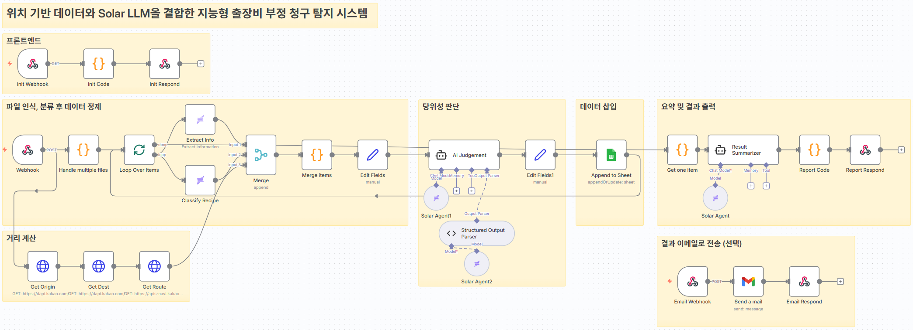

<div align="center">

# Solar FDS

위치 데이터와 Upstage Solar LLM을 결합한 출장비 부정 청구 탐지 시스템

</div>

---

## 목차

<details open>
<summary>바로가기</summary>

- [수상](#수상)
- [프로젝트 개요](#프로젝트-개요)
- [주요 성과](#주요-성과)
- [시스템 구성](#시스템-구성)
- [처리 흐름](#처리-흐름)
- [핵심 기능](#핵심-기능)
- [판정 기준](#판정-기준)
- [기술 스택](#기술-스택)
- [실행 방법](#실행-방법)
- [저장소 구조](#저장소-구조)
- [향후 개선](#향후-개선)
- [발표자료](#발표자료)
- [팀 역할](#팀-역할)

</details>

---

## 수상

- 2025 대학 X Upstage AI Agent 해커톤 대상
- 부문: 자유주제
- 팀명: `jogakbae`
- 주최: 경북대학교 소프트웨어교육원
- 수상일: 2025.12.10

## 프로젝트 개요

- 영수증과 출장 정보를 기반으로 출장비 이상 청구 자동 검증
- 영수증 분석, 지출 분류, 이동 거리 계산, AI 판정, 결과 리포팅 자동화
- n8n 기반 End-to-End 워크플로 구현

## 주요 성과

### 프로세스 혁신

| 구분 | 기존 방식 | Solar FDS |
| --- | --- | --- |
| 처리 과정 | 수취 → 입력 → 지도 앱 실행 → 주소 검색 → 경로 확인 → 계산 → 승인 | 영수증·출장 정보 업로드 후 자동 판정 |
| 업무 단계 | 7단계 | 1단계 |
| 기대 효과 | 반복 입력과 수기 검수 | 업무 단계 약 85% 축소, 오류 가능성 감소 |

### 검증 범위 확대

- 기존: 실제 이동 경로, 유류비 계산, 금지 품목 확인을 수작업으로 검증
- 개선: 경로·수식·지출 문맥을 결합한 다차원 검증
- 발표자료 기준 경로·공식·문맥 3개 영역 100% 검증 범위 설계

## 시스템 구성



## 처리 흐름

1. 영수증 이미지/PDF와 출장 기간·출발지·목적지 입력
2. 다중 영수증 파일 분리
3. Upstage Solar Pro 2로 지출일자·지출처·지출내용·금액 추출
4. 지출 항목을 회계 분류 기준으로 분류
5. Kakao Local API로 주소 좌표 변환
6. Kakao Mobility Directions API로 이동 거리 계산
7. AI Judgement Agent가 `합격/불합격`과 사유 생성
8. Google Sheets 기록 및 결과 리포트 출력
9. 이메일 전송 선택 지원

## 핵심 기능

- 다중 영수증 일괄 처리
- Solar Pro 2 기반 문맥 인식형 정보 추출
- 지출 항목 자동 분류
- 출장 경로 및 이동 거리 계산
- 출장 기간·품목·유류비·경로 기반 이상 청구 판단
- Structured Output Parser 기반 `judgment`, `reason` JSON 출력
- Google Sheets 자동 기록
- 웹 리포트 및 이메일 결과 전송

## 판정 기준

- 기간: 지출일시가 출장 시작일부터 복귀일까지 포함되는지 확인
- 품목: 주류·담배·상품권·유흥 관련 항목 탐지
- 유류비: `(총거리 ÷ 10) × 1700 × 1.3` 한도와 청구 금액 비교
- 위치: 출발지·목적지·지출처 주소의 행정구역 및 경로 일치 여부 판단

## 기술 스택

`Upstage Solar Pro 2` · `n8n` · `Kakao Local API` · `Kakao Mobility Directions API` · `Google Sheets` · `Gmail`

## 실행 방법

1. n8n에서 [`workflow.json`](./workflow.json) import
2. Upstage, Kakao, Google Sheets, Gmail Credentials 연결
3. `YOUR_SHEET_ID`, `your-n8n-host.example` placeholder 교체
4. workflow 활성화

입력값:

- `file`: 영수증 이미지/PDF
- `start_date`: 출장 시작일
- `end_date`: 출장 복귀일
- `origin`: 출발지
- `destination`: 목적지

## 저장소 구조

```text
.
├── README.md
├── workflow.json
├── assets/
│   └── workflow.png
└── docs/
    └── presentation.pdf
```

## 향후 개선

- 영수증에서 지출처 주소 추출 후 실제 결제 위치 검증
- 이동 거리 단위와 유류비 수식 단위 통일
- 테스트 데이터 기반 precision·recall 측정
- webhook 인증 및 개인정보 보관 정책 적용

## 발표자료

- [발표자료](./docs/presentation.pdf)

## 팀 역할

| 이름 | 역할 | GitHub |
| --- | --- | --- |
| 천창용 | 팀장, AI Agent 처리, 발표 | https://github.com/You42Gwa |
| 조희종 | n8n 워크플로 총괄, 기능 구현 | https://github.com/WhiPaper |
| 최현호 | 거리 계산 시스템 구현, 기능 구현 | https://github.com/hoboy1 |
